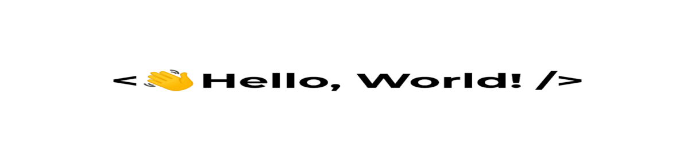

    
    

    

## 📖 About Me
- 🎓 Computer Science Student @Parul University
- Competent in:
    - Machine Learning
    - Data Structures and Algorithms
    - Backend Development
    
- Check out - <a href="https://drive.google.com/file/d/1KF3zV0RKvpq3R1kEaKvCiuvBbuDbU3-t/view?usp=drive_link" target="_blank">📄 Resume</a>

## Programming Languages

## Databases

## Technologies

## Machine Learning

## Collaboration Tools

## Operating Systems

## Developer Tools

## My Stats

<h3 align=center>

&nbsp;

</h3>
<h3 align=center>

</h3>
